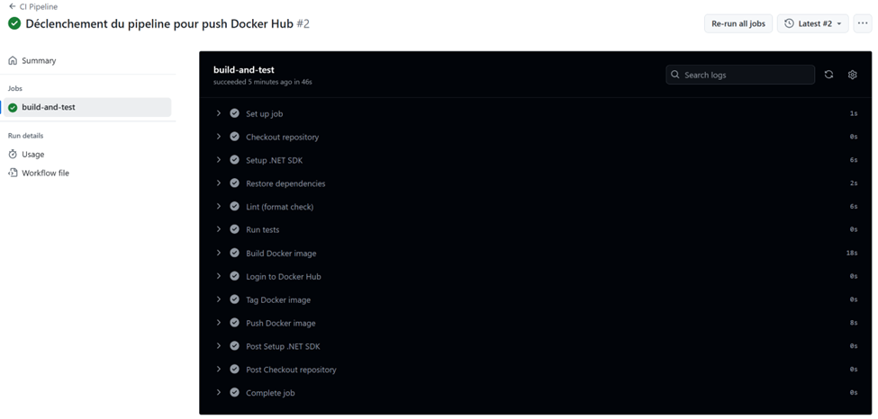

# 🚀 LABO 0 — LOG430 | Infrastructure de base avec CI/CD et Docker

## Répo github du projet (publique)
 - https://github.com/itsahmed98/log430-lab0

## 📝 Brève description de l’application

Ce projet contient une application Web API minimale développée en .NET 8. Elle expose une route GET `/` qui retourne un message simple : 
`"Début de lab0 log430!"`.

Ce projet sert de base technique pour les prochains laboratoires du cours LOG430 — Architecture Logicielle.

---

## 🧱 Structure du projet

log430-lab0/
│
├── minimalAPI/ # Code source principal de l'application API
│ └── Program.cs # Point d'entrée de l'application
│
├── minimalAPI.Tests/ # Projet de tests unitaires (xUnit)
│ └── UnitTest1.cs
│
├── Dockerfile # Dockerfile pour conteneuriser l'application
├── docker-compose.yml # Fichier Docker Compose pour orchestration
│
├── .github/workflows/ci.yml # Pipeline CI/CD GitHub Actions
├── .gitignore
└── README.md

---

## ⚙️ Architecture du projet

L'application suit une architecture simple basée sur :

- **Minimal API** (ASP.NET Core)
- **Docker** pour la conteneurisation
- **Docker Compose** pour l’orchestration
- **GitHub Actions** pour CI/CD automatisé
- **xUnit** pour les tests unitaires

Le pipeline CI/CD :
1. Restaure les dépendances
2. Vérifie la mise en forme du code (Linting)
3. Lance les tests unitaires (avec xunit)
4. Construit l’image Docker
5. Publie l’image sur Docker Hub (avec un tag par defaut "latest")
    - `docker.io/ahmedsherif98/log430-lab0-api:latest`

---

## 🛠️ Étapes d’installation et d’exécution

### ✅ 1. Cloner le dépôt et aller dans le fichier racine
    - git clone "url du projet"
    - cd log430-lab0

### ✅ 2. Lancer l'application avec docker compose
    - docker compose up --build -d

### ✅ 3. Accèder à l'API
    - curl http://localhost:8080
    - Message reçu: "Début de lab0 log430!"

## 📦 Image Docker Hub
Les images sont disponible ici: https://hub.docker.com/u/ahmedsherif98

pour récupèrer une imgage (ex: log430-lab0-api)
    - docker pull ahmedsherif98/log430-lab0-api:latest
    - docker run -d -p 8080:80 ahmedsherif98/log430-lab0-api

## 🖼️ CI/CD — Pipeline
 - https://github.com/itsahmed98/log430-lab0/actions
 

## 👨‍💻 Auteur
Ahmed Akram Sherif
Étudiant au baccalauréat en génie logiciel
Cours : LOG430 — Été 2025